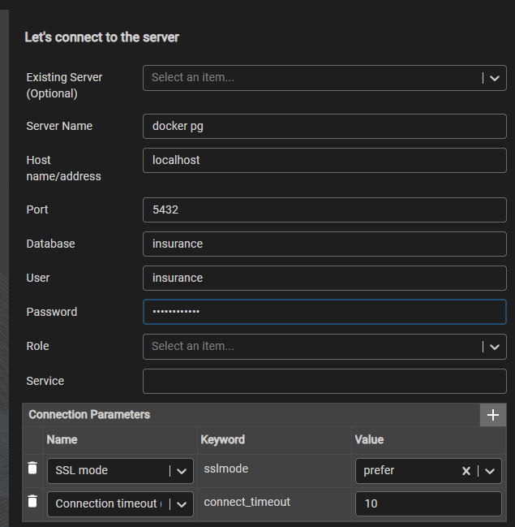

# Vaudoise Insurance API

A RESTful API for managing insurance clients and contracts, built with Spring Boot and Java 21.

## 📋 Table of Contents
- [🏗️ Architecture Overview](#-architecture-overview)
- [🚀 Quick Start](#-quick-start)
- [📚 API Documentation](#-api-documentation)
- [🧪 Testing the API](#-testing-the-api)
- [🛠️ Technical Stack](#-technical-stack)
- [✨ Key Features](#-key-features)
- [📝 Notes](#-notes)
- [🔧 Development](#-development)
- [📄 License](#-license)

---

## 🏗️ Architecture Overview

### Design Philosophy (Max 1000 chars)

This API follows a **layered architecture** with clear separation of concerns:

**1. Domain Layer**: Entities use Single Table Inheritance for Client polymorphism (Person/Company), enabling type-safe operations while maintaining referential integrity. Immutable fields (birthDate, companyIdentifier) are enforced at the database level.

**2. Repository Layer**: Spring Data JPA with optimized queries. The performant total-cost endpoint uses a single aggregation query with proper indexing on endDate and clientId.

**3. Service Layer**: Business logic including soft-delete (contracts end-dated on client deletion) and automatic timestamp management (lastModifiedDate hidden from API).

**4. Controller Layer**: RESTful endpoints with comprehensive validation using Jakarta Bean Validation.

**Key Decisions**:
- H2 file-based database for persistence across restarts
- postgres SQL DB for the dockerized application (not synchronized with H2)
- Soft-delete pattern preserves audit trail
- ISO 8601 date formatting throughout
- Indexed queries for performance
- Transactional consistency for cascading operations

---

## 🚀 Quick Start

### Prerequisites
- Java 21 or higher
- Maven 3.6+
- Spring boot 3.2.0

### Running the Application

1. **Clone the repository**
```bash
git clone https://github.com/Aymeriko/insurance-api.git
cd insurance-api
```

2. **Build the project**
```bash
mvn clean install
```

3.1 **Run the application with maven**
```bash
mvn spring-boot:run
```

3.2 **Run the application with docker**
```bash
docker-compose up -d --build
docker-compose down
```

To see running containers and logs:
```bash
docker-compose ps
docker-compose logs insurance-api
docker-compose logs postgres
```


The API will start on `http://localhost:8080`


### Database Console

If you do not use docker :
Access H2 console at: `http://localhost:8080/h2-console`
- JDBC URL: `jdbc:h2:file:./data/insurance`
- Username: `sa`
- Password: *(leave empty)*

If you use docker : 
Access postgres using the CLI or a UI tool, for example pgAdmin : 


password : insurance123

---

## 📚 API Documentation

### Base URL
```
http://localhost:8080/api
```

### Client Endpoints

| Operation | Endpoint                                        | Entity |
|-----------|-------------------------------------------------|--------|
| Create Person | POST /api/clients/persons                       | Person |
| Create Company | POST /api/clients/companies                     | Company |
| Get Client | GET /api/clients/{id}                           | Client |
| Update Client | PUT /api/clients/{id}                      | Client |
| Delete Client | DELETE /api/clients/{id}                        | Client |
| Create Contract | POST /api/clients/{clientId}/contracts          | Contract |
| Update Contract Cost | PUT /api/contracts/{id}/cost                    | Contract |
| Get Client Contracts | GET /api/clients/{clientId}/contracts           | Contract |
| Get Total Cost | GET /api/clients/{clientId}/contracts/total-cost | Contract |

Further documentation available on the [swagger](http://localhost:8080/swagger-ui.html) : 


Example API call on docs/api_insurance_postman.json
Generated using Bruno


---

## 🧪 Testing the API

### Using cURL

**Create a Person:**
```bash
curl -X POST http://localhost:8080/api/clients/persons \
  -H "Content-Type: application/json" \
  -d '{
      "firstName": "Mijoe",
      "lastName": "Ndong",
      "birthDate": "1990-01-15",
      "clientType": "PERSON",
      "phone": "+33606060606",
      "email": "john.doe@example.com"  
    }'
```

**Create a Contract for client with clientID n°1 :**

Required fields:
- `costAmount` (required): The cost amount of the contract (must be a positive number with 2 decimal places)

Optional fields:
- `startDate` (optional, defaults to current date if not provided): The start date of the contract in 'YYYY-MM-DD' format
- `endDate` (optional): The end date of the contract in 'YYYY-MM-DD' format (null for indefinite contracts)

Example:
```bash
curl -X POST http://localhost:8080/api/clients/1/contracts \
  -H "Content-Type: application/json" \
  -d '{
    "startDate": "2024-01-01",
    "endDate": "2025-12-31",
    "costAmount": 2500.00
  }'
```

Minimum valid request (uses current date as start date and no end date):
```bash
curl -X POST http://localhost:8080/api/clients/1/contracts \
  -H "Content-Type: application/json" \
  -d '{"costAmount": 1500.50}'
```

**Get Total Cost:**
```bash
curl http://localhost:8080/api/clients/1/contracts/total-cost
```

### Using Postman

Import the provided collection: `docs/Insurance-API.postman_collection.json`

### Validation Examples

The API validates all inputs:

**Invalid Email:**
```json
{
  "name": "Test",
  "email": "invalid-email",
  "phone": "+41211234567",
  "birthDate": "1990-01-01"
}
```
Response: `400 Bad Request` with validation errors

**Invalid Company Identifier:**
```json
{
  "companyIdentifier": "INVALID"
}
```
Response: `400 Bad Request` - Must match format XXX-123

**Invalid Cost Amount:**
```json
{
  "costAmount": -100
}
```
Response: `400 Bad Request` - Must be positive

---

## 🛠️ Technical Stack

- **Java 21** - Programming language
- **Spring Boot 3.2.0** - Application framework
- **Spring Data JPA** - Data persistence
- **Hibernate** - ORM
- **H2 Database (Embedded database with file persistence) or postgres database** - depends how you host the app 
- **Lombok** - Reduces boilerplate code
- **Jakarta Bean Validation** - Input validation
- **Maven** - Build tool

---


## ✨ Key Features

### ✅ Implemented Requirements

- [x] Create Person and Company clients with validation
- [x] Read client with all fields
- [x] Update client (excluding immutable fields)
- [x] Delete client with contract end-dating
- [x] Create contracts with default start date
- [x] Update contract cost with automatic timestamp
- [x] Get active contracts with optional date filtering
- [x] Performant total cost calculation endpoint
- [x] ISO 8601 date format throughout
- [x] Comprehensive validation (email, phone, dates, numbers)
- [x] RESTful API design with JSON
- [x] File-based persistence (survives restarts)
- [x] Descriptive code with clear naming

### 🚀 Performance Optimizations

1. **Database Indexes**: On ids of contract and clients
2. **Aggregation Query**: Single query for total cost calculation
3. **Transactional Boundaries**: Proper transaction management
4. **Query Optimization**: Filtered queries at database level

### 🛡️ Data Integrity

- Immutable fields enforced at entity level
- Validation at multiple layers (DTO, Entity, Database)
- Soft-delete pattern for audit trail
- Transactional consistency for cascading operations

---

## 📝 Notes

- H2 Database persists in `./data/insurance.mv.db`
- postgres DB data persists in a docker volume
- All dates use ISO 8601 format
- Active contracts: `endDate == null OR endDate > currentDate`
- lastModifiedDate is internal and not exposed in API responses
- Company identifier format: 3 uppercase letters, hyphen, 3 digits (e.g., ABC-123)

---

## 🔧 Development

### Generate a package locally
```bash
mvn clean package
java -jar target/insurance-api-1.0.0.jar
```

### CI/CD
The github repository is configured to check the following requirements on every commit
- Unit tests passed 
- coverage 70%
- code formatting 

A merge in the main branch automatically triggers a release.

### Running Tests and coverage
```bash
mvn verify
open target/site/jacoco/index.html
```

---

## 📄 License

This project is part of a technical exercise for La Vaudoise.
